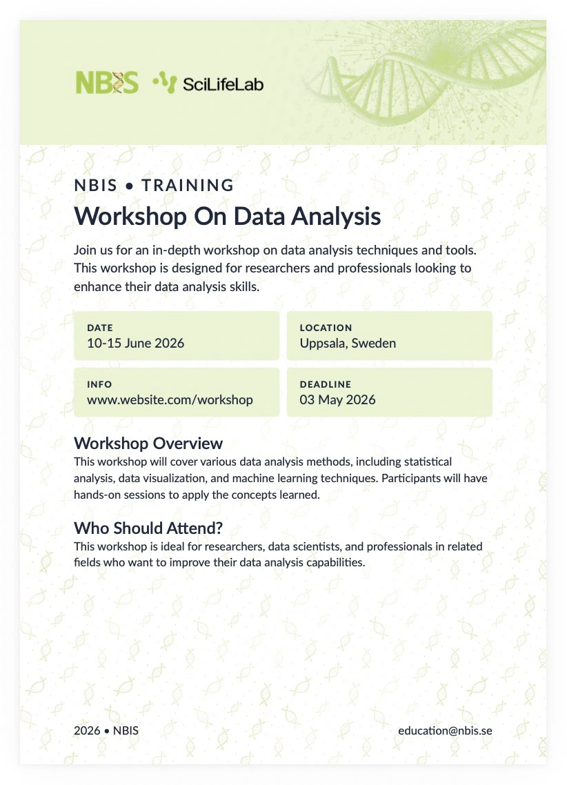

# quarto-typst-flyer

A Quarto extension that uses Typst to create an NBIS-branded flyer



## Installation

```
quarto use template royfrancis/quarto-typst-flyer
```

## Render

```
quarto render index.qmd
```

To modify parameters;

```
quarto render index.qmd --metadata title:"Your Flyer Title"
```

## Flyer metadata

The Typst template accepts the following top-level fields:

- `subtitle` (string) – Uppercase text rendered above the title
- `title` (string) – Main workshop headline shown prominently
- `description` (multiline string) – Short summary paragraph
- `content` (multiline string) – Optional extra paragraph injected below info chips
- `date-range` (string) – Dates displayed inside the info chip grid
- `location` (string) – Venue/location line used in the info chip grid
- `info` (string) – Additional link/website or note that appears in the info chip grid
- `deadline` (string) – Application/registration deadline in the info chip grid
- `bg-image.path` (file path) – Background image that fills the entire page
- `banner-image.path` (file path) – Hero/banner artwork spanning the top grid row
- `banner-height` (length, e.g., `5cm`) – Height of the banner strip
- `logo-image.path` (file path) – Logo placed top-left within the banner area
- `logo-height` (length, e.g., `2cm`) – Rendered height for the supplied logo image
- `font-size` (length, e.g., `13pt`) – Base body font size; heading sizes scale from it
- `color-text` (color or hex string) – Text color
- `color-info` (color or hex string) – Background color for the info chip blocks
- `footer-left` (string) – Left-aligned footer text (e.g., year or organization)
- `footer-right` (string) – Right-aligned footer text (e.g., contact email)

---

2026 • Roy Francis
